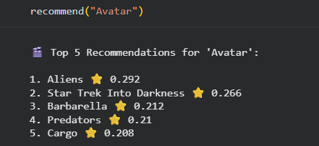
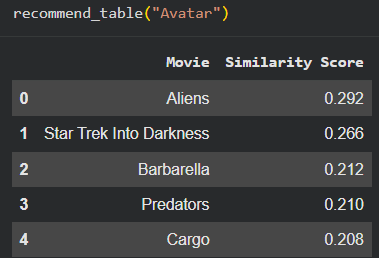
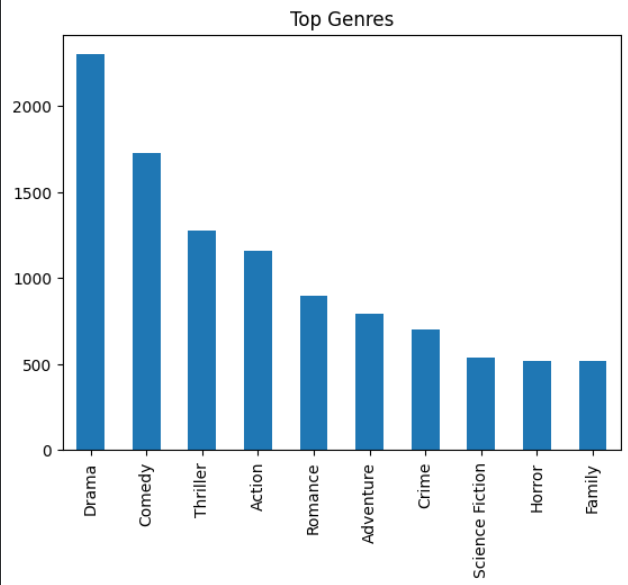

# 🎬 Movie Recommendation System (Advanced)

## 📌 Overview

This project builds an advanced movie recommendation system that suggests movies based on content similarity, popularity, and user preferences.

---

## 🎯 Objective

To design a recommendation engine that mimics real-world platforms like Netflix by analyzing movie metadata and generating meaningful suggestions.

---

## 🚀 Features

* Content-based recommendation using TF-IDF & cosine similarity
* Weighted feature engineering (genres, keywords, cast, crew)
* Popularity-based ranking (rating + similarity)
* Genre-based recommendation
* Diversity-based recommendation
* Clean and structured output
* Model saving for deployment

---

## 🧠 Technologies Used

* Python
* Pandas, NumPy
* Scikit-learn
* Matplotlib, Seaborn

---

## 📂 Project Structure

* movie_recommendation.ipynb → Main notebook
* similarity.pkl → Similarity matrix
* movie_list.pkl → Processed dataset
* images/ → Output screenshots

---

## 📊 Sample Outputs

The following visualizations demonstrate the performance and capabilities of the recommendation system:

---

### 🎬 Top Movie Recommendations
Example output showing similarity-based recommendations for a given movie.



---

### 📋 Structured Recommendation Table
Clean tabular output displaying recommended movies with similarity scores.



---

### 📊 Genre Distribution Analysis
Visualization of the most common movie genres in the dataset.



---

### 🔥 Similarity Heatmap
Heatmap representing similarity between movies based on feature vectors.


---

## ⚙️ How to Run

1. Upload dataset files
2. Run notebook step-by-step
3. Use:

```python
recommend("Avatar")
```

---

## 🔥 Why this Project Stands Out

* Implements multiple recommendation strategies
* Uses real-world system design logic
* Provides explainable and structured outputs
* Demonstrates strong feature engineering skills

---

## 🏆 Outcome

Built a scalable recommendation system capable of generating meaningful and diverse movie suggestions.

---

## 🚀 Future Improvements

* Add user-based collaborative filtering
* Deploy using Streamlit
* Integrate movie posters API

---

## 👨‍💻 Author

Shreya K Reddy
